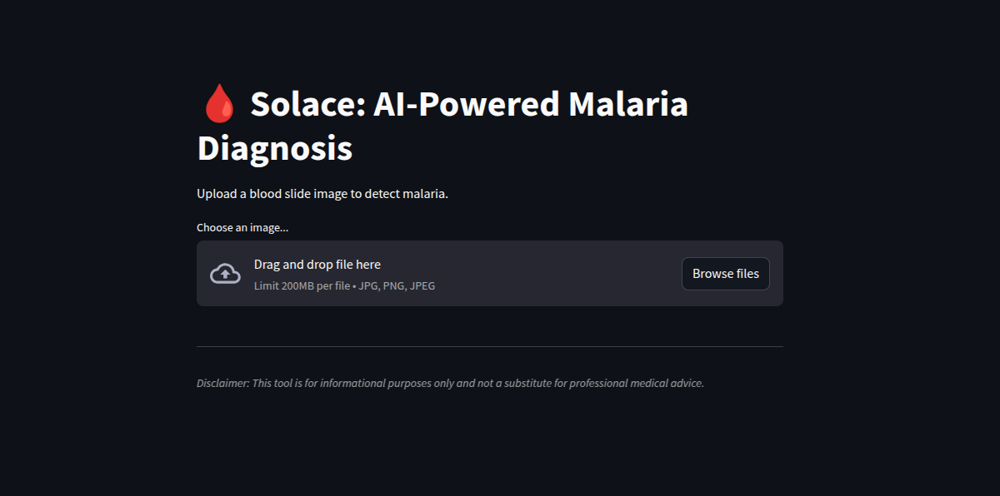
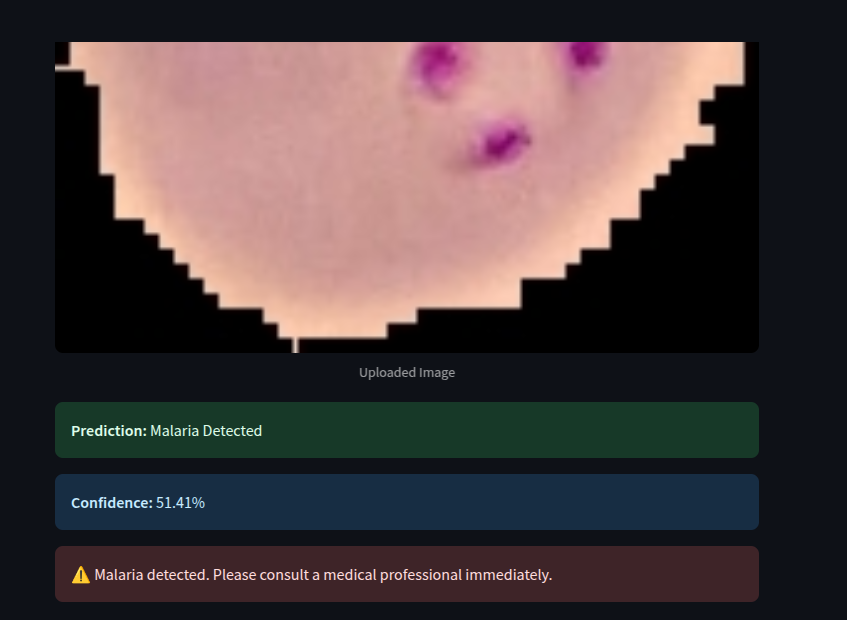

# Solace: AI-Powered Malaria Diagnosis

## Description
Solace is an AI-driven application that leverages deep learning to analyze blood cell images for rapid and accurate malaria diagnosis. Designed for use in resource-limited settings, Solace provides life-saving insights with high precision, making malaria detection more accessible and efficient.

---

## Features
✅ AI-powered malaria detection from blood cell images  
✅ High accuracy using deep learning models  
✅ Fast and reliable results in real-time  
✅ Designed for offline and low-resource environments  
✅ User-friendly interface for healthcare professionals  
✅ Secure and privacy-focused data handling  

---

## How It Works
1. **Upload Image** – Users upload a microscopic blood smear image.  
2. **AI Analysis** – The deep learning model processes the image and detects malaria-infected cells.  
3. **Diagnosis Output** – The app provides a detailed report, including the probability of infection.  

---
---
## Screenshots
### Upload Image Screen


### Diagnosis Output


---
## Tech Stack
- **Frontend:** Streamlit  
- **Backend:** N/A (Only Google Colab for model execution)  
- **AI Model:** TensorFlow (Fine-tuned VGG model)  
- **Dataset:** [Malaria Dataset](https://storage.googleapis.com/inspirit-ai-data-bucket-1/Data/Deep%20Dives/malaria_images.zip)  

---

## Installation & Setup
### Prerequisites
- Python (3.8+)
- TensorFlow
- Streamlit

### Clone the Repository
```bash
git clone https://github.com/abj360/solace-app
cd solace-app
```

---

## Usage
1. Open the Google Colab notebook in the repository.
2. Run the notebook to execute the AI model.
3. Upload a microscopic image of a blood sample.
4. Wait for the AI model to analyze the image.
5. Receive a detailed diagnosis report.  

---

## Model Training (For Developers)
To train the AI model:
```bash
python train.py --epochs [number] --batch_size [size]
```
- Dataset: [Malaria Dataset](https://storage.googleapis.com/inspirit-ai-data-bucket-1/Data/Deep%20Dives/malaria_images.zip)  
- Training parameters: Fine-tuned VGG model with TensorFlow  

---

## Deployment
Since Solace currently runs in Google Colab, deployment is not applicable. Future iterations may integrate deployment via Streamlit Cloud or a dedicated server.

---

## Contributing
Pull requests are welcome! Follow these steps:
1. Fork the repo.
2. Create a new branch (`git checkout -b feature-name`).
3. Commit changes (`git commit -m "Added feature X"`).
4. Push to your branch (`git push origin feature-name`).
5. Open a PR.

---

## License
This project is licensed under the **MIT License**. See `LICENSE.md` for details.

---

## Contact
For questions or collaborations:  
📧 Email: [oluwatoyosi.abolaji25@gmail.com]  
